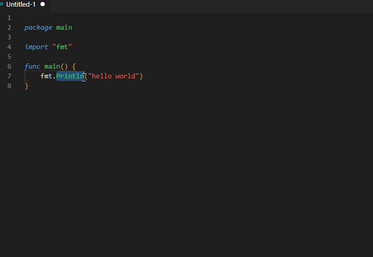

# README

Go to various manuals with one click (opens in browser).

VSCode Marketplace:
https://marketplace.visualstudio.com/items?itemName=rhasan.gotomanual

Github Repo:
https://github.com/Rah1x/gotoManual

## Features

1] Supporting various Gotos:

* PHP manual for functions only (via PHP.net),
* CSS manual (via developer.mozilla.org)
* Golang search (via golang.org)
* Several other programming languages (see the list below)
* Stachoverflow search via google
* and the good ol google search

This is what it looks like once installed and when you right-click on a piece of code:

\
\

2] Editor's active language specific menu only = show only relevant menu. This means if you are working on a PHP file it will show various options related to PHP, but if you are working on a css file it will only show `goTo: CSS` option. Meanwhile `goTo: Google Search` is always available.

I will update this later as we go and add more options, but if you have anything in mind (for example if you want another manual, or another file type for one of these languages) just create an issue with the label `enhancement` at the github repo and I will add it as well:
https://github.com/Rah1x/gotoManual

3] Goto:Google search and Goto:stackoverflow search picks up the editor's language and adds it to the searched keyword to make the results more accurate. So if you select and search the keyworld "date" and the editor's language is php the google search will be very specific to php. While if its javascript the search results will be reflecting this language instead.

## Special Usage Instructions

1) **CSS**:
For pseudo class or elements, please select the starting colons (:) as well. For example `:last-child` with the colons instead of just `last-child`

## Requirements

On the first run you would need to add the url base (for example `google.com`) to the trusted domains.\
So when you select any goTo menu for the first time you will see a popup that looks like the following image. Just click on `Configure Trusted Domains` (only if you see a trusted domain btw).

\
\

## Extension Settings

This extension contributes the following settings:

* `gotomanual.url.Google`: url for Googling the selected text
* `gotomanual.url.GoogleStackOverFlow`: url for Googling the selected text for stackoverflow
* `gotomanual.url.PHP`: url for PHP 'function' search via php.net
* `gotomanual.url.CSS`: url for CSS reference search via developer.mozilla.org
* `gotomanual.url.Python`: url for Python reference search via docs.python.org
* `gotomanual.url.Golang`: url for Golang reference search via golang.org
* `gotomanual.url.CPP`: url for C++ reference search via documentation.help
* `gotomanual.url.Rust`: url for Rust reference search via doc.rust-lang.org
* `gotomanual.url.Perl`: url for Perl reference search via perldoc.perl.org
* `gotomanual.url.R`: url for R reference search via rdocumentation.org
* `gotomanual.url.Swift`: url for Swift reference search via developer.apple.com
* `gotomanual.url.Julia`: url for Julia reference search via docs.julialang.org
* `gotomanual.url.Matlab`: url for Matlab reference search via mathworks.com
* `gotomanual.url.Mysql`: url for Mysql reference search via mariadb.com

## 1.0.0
New version based on vscode engine ^1.91.0
Support for more prgramming languages added

## 0.2.3
Stackoverflow search (via google) added

## 0.2.0

C++ reference search added,
Extension script code improved

## 0.1.1

GoLang reference search added

## 0.0.61

Python reference search added

## 0.0.55

Language specific activation

## 0.0.5

CSS manual added

## 0.0.4

Minor fixes

## 0.0.1

Initial release
