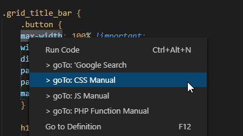
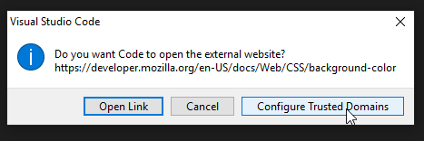
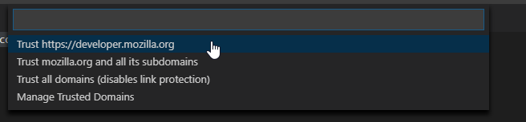

# README

Go to various manuals with one click (opens in browser).

VSCode Marketplace:
https://marketplace.visualstudio.com/items?itemName=rhasan.gotomanual

Github Repo:
https://github.com/Rah1x/gotoManual

## Features

1] Supporting various manuals:

* PHP Manual for functions only (via PHP.net),
* JS Manual (via W3School),
* CSS Manual (via developer.mozilla.org)
* and the good ol google search

This is what it looks like once installed and when you right-click on a piece of code:

2] Editor's active language specific menu only = show only relevant menu. This means if you are working on a PHP file it will show all options, but if you are working on a css file it will only show `goTo: CSS` option. Meanwhile `goTo: Google Search` is always available.

I will update this later as we go and add more options, but if you have anything in mind (for example if you want another manual, or another file type for one of these languages) just create an issue with the label `enhancement` at the github repo and I will add it as well:
https://github.com/Rah1x/gotoManual

## Special Usage Instructions

1) **CSS**:
For pseudo class or elements, please select the starting colons (:) as well. For example `:last-child` with the colons instead of just `last-child`

## Requirements

On the first run you would need to add the url base (for example `google.com`) to the trusted domains.\
So when you select any goTo menu for the first time you will see a popup that looks like the following image. Just click on `Configure Trusted Domains` (only if you see a trusted domain btw).

\
\

## Extension Settings

This extension contributes the following settings:

* `gotomanual.url.Google`: url for Google Search selected text
* `gotomanual.url.PHP`: url for PHP 'function' search via php.net
* `gotomanual.url.JS`: url for JS Reference Search via W3School
* `gotomanual.url.CSS`: url for CSS Reference Search via developer.mozilla.org

## 0.0.55

Editor's active language specific menu only = show only relevant menu. This means if you are working on a PHP file it will show all options, but if you are working on a css file it will only show `goTo: CSS` option. Meanwhile `goTo: Google Search` is always available.

## 0.0.5

CSS manual added

## 0.0.4

Minor fixes

## 0.0.1

Initial release
